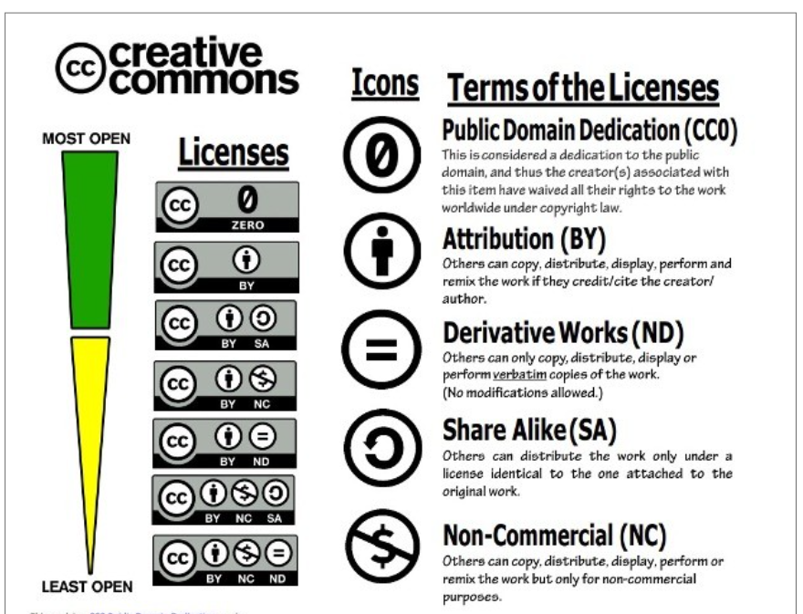

# Notes from AP Classroom video
- Essential Knowledge
    - Material created on a computer is the intellectual property of hte creator or the organizaiton
        - whatever you make on a computer is yours, or the property of your organization
    - Ease of Access and distribution of digitized information raises intellectual property concerns regarding ownership, value, and use
        - How easily information is found online makes ownership rights kind of complicated (a lot of people just kinda take it and yea:)
    - Measures should be taken to safeguard intellectual property.
        - we need to protect our online info
    - If you take someone else' work as your own, this is illegal bc it is plagarism
    - to legally use other ppl's stuff, you can ask the maker, who has the right to give u their work if they want
    - Types of licenses: 
        - Open source: Programs are made freely available and may be redistributed and modified
        - Open Access: Online research output free of any and all restriction on access and free of many restrictions on use, such as copyright or license restrictions.
    - Must cite sources
    - Creative Commons, open source, and open access have enabled broad access to digital information.
    - As with any technology or medium, using computing to harm individuals or groups of people raises legal and ethical concerns.
    - Computing can play a role in social and political issues, which in turn often raises legal and ethical concerns.
    - The digital divide raises ethical concerns around computing.
    - Computing innovations can raise legal and ethical concerns.
        - Ex. The development of software that allows access to digital media downloads and streaming
    - the development of software that allows access to digital media downloads and streaming
    - the development of algorithms that include bias
    - the existence of computing devices that collect and analyze data by continuously monitoring activities
    - Intellectual Property (IP): a work or invention that is the result of creativity to which one has rights
    - Copyright protects your IP and keeps anyone from using it, unless you give them your permission.
    - Plagiarism: Presenting material as your own
    - Legal ways to use material created by someone else:
        - Creative Commons
        - open source
        - open access
        note: we can add exactly what the consequences are, like if it's a fine, fine is $250,000

